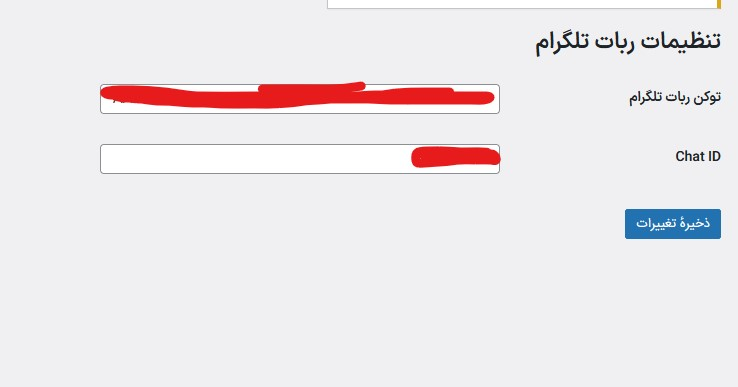
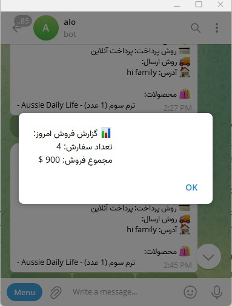
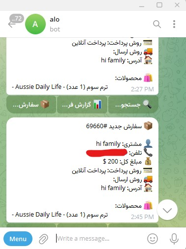

این پلاگین به شما امکان می‌دهد که تمامی سفارش‌های جدید ووکامرس به صورت خودکار برای ربات تلگرام ارسال شوند. همچنین منویی داخل تلگرام خواهید داشت که شامل امکانات مدیریتی مثل گزارش‌گیری و جستجوی سفارش‌هاست.

 امکانات

ارسال خودکار جزئیات کامل سفارش جدید به تلگرام

دکمه‌های اینلاین کیبورد برای مدیریت سریع:

 سفارش‌های امروز

 گزارش فروش

 جستجوی سفارش

مشاهده نام مشتری، تلفن، آدرس، روش پرداخت و روش ارسال

نمایش لیست محصولات داخل سفارش

پشتیبانی از چندین مدیر (با استفاده از chat ID های مختلف)

پشتیبانی از تمام روش‌های پرداخت ووکامرس

بعد از فعال‌سازی:

از منوی تنظیمات → تلگرام ووکامرس می‌توانید موارد زیر را تنظیم کنید:

توکن ربات تلگرام (Bot Token)

Chat ID (شناسه عددی چت مدیر)

اتصال ربات به سایت (Webhook)

ابتدا ربات خود را در BotFather بسازید و Bot Token بگیرید.

سپس دستور زیر را در مرورگر باز کنید (توکن خود را جایگزین کنید):

https://api.telegram.org/bot<YOUR_BOT_TOKEN>/setWebhook?url=https://yourdomain.com/

